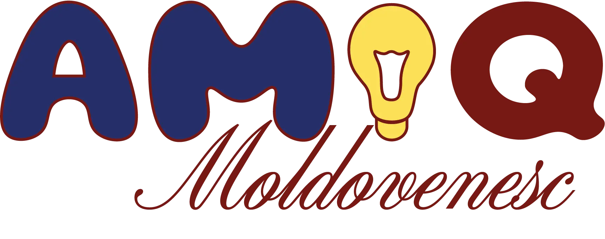

<p align="center">

</p>

# Regulamentul jocului
Așa cum a decurs în cadrul festivalului [Basarabie File din Poveste](https://atbbrasov.ro/evenimente/basarabie-file-din-poveste-2026/).

Jocul este compus din mai multe probe.
Fiecare echipă are un buton conectat la joc (prin microcalculator ESP).
Punctajul se va aplica echipei care prima a acționat butonul (sau în cazul probelor speciale, punctajul va fi pus de operator).

**Jucătorii sunt încurăjați să spuie răspunsul până la acționarea butonului :P**

## Ghicește proverbul
Vor apărea o serie de emoji-uri, iar misiunea este să identificarea proverbul pe care acestea îl reprezintă. 

## Ce? Unde? Când?
Jucători va trebui să răspundă la întrebările care vor apărea pe ecran

## Continuă melodia
Vor fi o serie de melodii nefinalizate: Simple – 10 puncte; Medii – 20 puncte; Complicate – 30 puncte; Foarte grele – 40 puncte.
Scopul participanților este să continue strofa care este întreruptă. Fiecare echipă își alege câte un reprezentant pentru fiecare categorie de melodie.
## Revizuiește cunoștințele
Apar 2 imagini, scopul participanților e să identifice legătura corectă dintre acestea și să formuleze răspunsul corect
## Regionalismul ascuns
Va apărea un regionalism folosit în anumite zone ale Republicii Moldova, iar participanții vor trebuie să identifice sensul acestuia.

## Adevăr sau Mit?
În această probă vor participa căpitanii echipelor. Fiecare căpitan va avea la dispoziție 1 minut pentru a răspunde la o serie de afirmații. Pentru fiecare afirmație, trebuie să răspundeți rapid cu: adevărat sau fals.
Operatorul va derula cronometrul. Punctajul va fi adăugat dupa recalculare manuală

# sv

Everything you need to build a Svelte project, powered by [`sv`](https://github.com/sveltejs/cli).

## Creating a project

If you're seeing this, you've probably already done this step. Congrats!

```sh
# create a new project
npx sv create my-app
```

To recreate this project with the same configuration:

```sh
# recreate this project
bun x sv create --template minimal --types ts --add prettier tailwindcss="plugins:forms" --install bun aMIQ
```

## Developing

Once you've created a project and installed dependencies with `npm install` (or `pnpm install` or `yarn`), start a development server:

```sh
npm run dev

# or start the server and open the app in a new browser tab
npm run dev -- --open
```

## Building

To create a production version of your app:

```sh
npm run build
```

You can preview the production build with `npm run preview`.

> To deploy your app, you may need to install an [adapter](https://svelte.dev/docs/kit/adapters) for your target environment.

# ESP

Pentru a nu se conecta la esp cu `sudo` am rulat următoarea comandă `sudo usermod -aG dialout $USER`

Trebuie de adăugat numele și parola la Wi-Fi!
